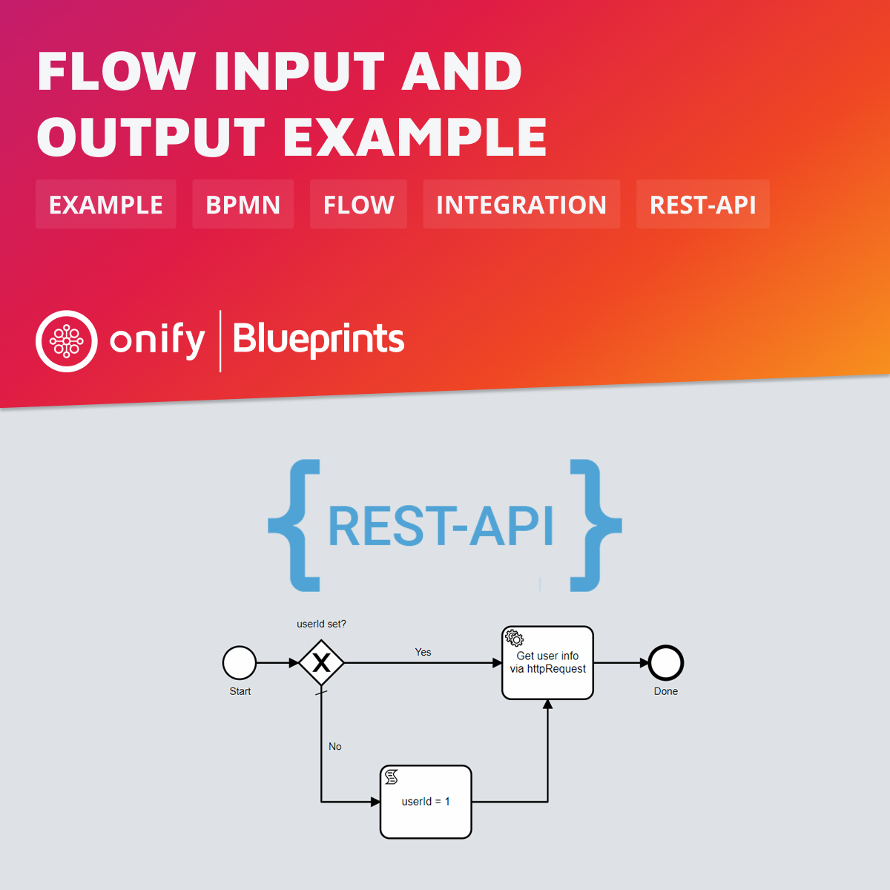

# Onify Blueprint: Flow Input and Output example

Want to start a process in the background with input parameters? Here is how! This will also return back output in the process that you can use. You can very easy now connect a Onify workflow/flow (BPMN) using our powerful REST-API to your own system.

## Requirements

* Onify Hub v2
* Onify Flow license
* Camunda Modeler 4.4 or later 

## Included

* 1 x Flows

## Setup

### Flows

#### Deploy

1. Open `flow-input-output-example.bpmn` in Camunda Modeler
2. Click `Deploy current diagram` and follow the steps

#### Run 

##### Run from modeler

1. Open `flow-input-output-example.bpmn` in Camunda Modeler
2. Run the flow by clicking `Start current diagram`

##### Run via API request

Here is a curl example:

`curl -X POST "http://localhost:8181/api/v2/admin/processes/start/flow-input-output-example" -H "accept: application/json" -H "authorization: <AUTH_TOKEN>" -H "Content-Type: application/json" -d "{ \"title\": \"Test\", \"input\": {\"userId\" : 2}}"`

#### Check results

**Check results via APP url:**

`http://localhost:3000/api/v2/my/processes/<PROCESSID>/output`

**Check results via API (and curl):**

`curl -X GET "http://localhost:8181/api/v2/admin/processes/<PROCESSID>/output" -H "accept: application/json" -H "authorization: <AUTH_TOKEN>"`

## Support

* Community/forum: https://support.onify.co/discuss
* Documentation: https://support.onify.co/docs
* Support and SLA: https://support.onify.co/docs/get-support

## License

This project is licensed under the MIT License - see the [LICENSE](LICENSE) file for details.
